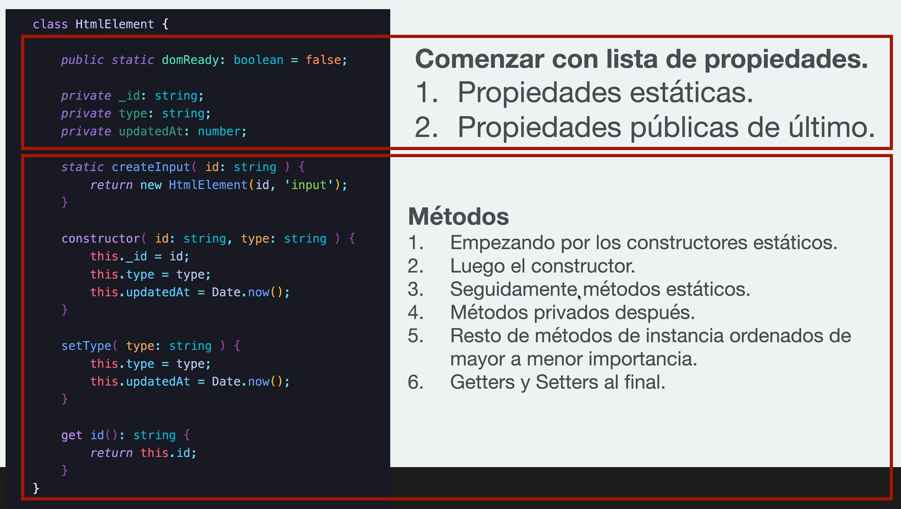

# Sección 3: Clean Code - Clases y Comentarios

## Estructura recomendada de una clase

> "El buen código parece estar escrito por alguien a quien le importa".
>
> -   Michael Feathers

**Estructura recomendada de una clase:**
Comenzar con lista de propiedades.

1. Propiedades estáticas.
2. Propiedades públicas de último.

Métodos

1. Empezando por los constructores estáticos.
2. Luego el constructor.
3. Seguidamente métodos estáticos.
4. Métodos privados después.
5. Resto de métodos de instancia ordenados de mayor a menor importancia.
6. Getters y Setters al final.



## Comentarios en el código

Muchos de los comentarios son inútiles y explican lo que ya está explicado en el código.

**Evita usar comentarios, pero...**
Cuando usamos librerías de terceros, APIS, frameworks, etc. nos encontraremos ante situaciones en las que escribir un comentario será mejor que dejar una solución compleja o un hack sin explicación.  
Los comentarios deberían de ser la excepción, no la regla.

Ejemplo de un mal código

```ts
const name = John Doe;
// Si name es igual a 'John Doel
if (name === John Doel ) {
// entonces....
}
```

> "No comentes el código mal escrito, reescríbelo".
>
> -   Brian W. Kernighan

**Recuerda:**  
Nuestro código debe de ser suficientemente auto explicativo.
Pero a veces es necesario comentarlo
¿El por qué? En lugar del ¿qué? o ¿cómo?

## Uniformidad en el proyecto

Problemas similares, soluciones similares

```ts
// original
const createProduct = () => {};
const updateProduct = () => {};
const deleteProduct = () => {};
// otro similar
const createUser = () => {};
const updateUser = () => {};
const deleteUser = () => {};
```

No solo se debería aplicar en el código, también en los directorios por ejemplo.

**Indentación**  
Debe ser uniforme y seguir las reglas de la organización o el lenguaje.
